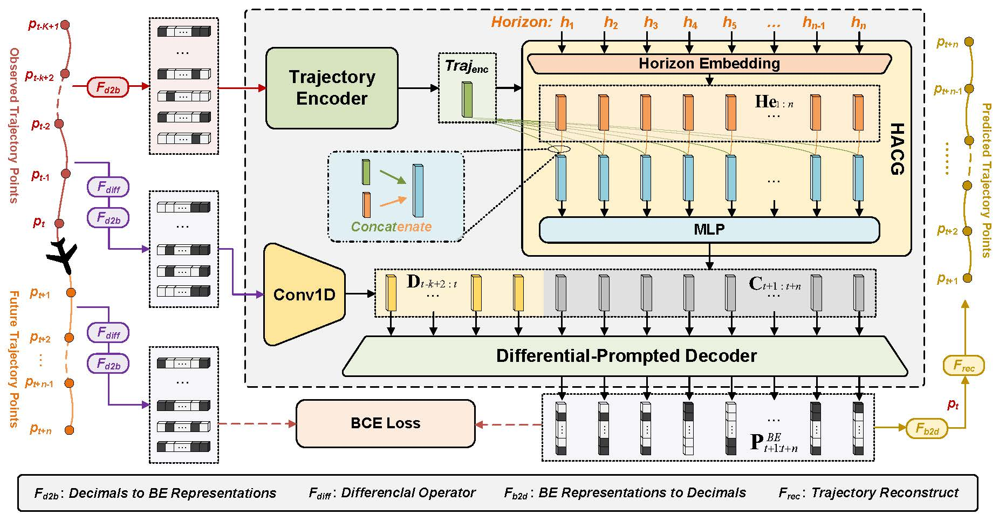

# FlightBERT++: A Non-autoregressive Multi-Horizon Flight Trajectory Prediction Framework

# Introduction

This repository provides source codes of the proposed flight trajectory prediction framework, called FlightBERT++, 
and example samples for the paper <a href="https://ojs.aaai.org/index.php/AAAI/article/view/27763">FlightBERT++: A Non-autoregressive Multi-Horizon Flight Trajectory Prediction Framework</a>. 
This work is proposed to i) forecast multi-
horizon flight trajectories directly in a non-autoregressive way, and ii) improved the limitation of the binary encoding (BE) 
representation in our previous work <a href="https://ieeexplore.ieee.org/document/9945661">FlightBERT</a>. 

<p  align="middle"></p>

## Repository Structure
```
FlightBERT++
│  dataloader.py (Load trajectory data from ./data)
│  LICENSE (LICENSE file)
│  model.py (The neural architecture corresponding to the FlightBERT++ framework)
│  README.md (The current README file)
│  run.py (The main file for the model training and testing)
│  utils.py (Tools for the project)
├─data
│  │ README.md (README file for the dataset.)
│  │ example_data.txt (Example data file)
│  ├─dev (Archive for the validation data)
│  ├─test (Archive for the test data)
│  └─train (Archive for the training data)
└─pics
```

## Package Requirements

+ Python == 3.7.1
+ torch == 1.9.0 + cu110
+ numpy == 1.18.5
+ matplotlib == 3.2.1

## System Requirements
+ Ubuntu 16.04 operating system
+ Intel(R) Core(TM) i7-7820X@3.6GHz CPU
+ 128G of memory
+ 8TB of hard disks
+ 8 $\times$ NVIDIA(R) GeForce RTX(TM) 2080 Ti 11G GPUs.


# Instructions
## Installation

### Clone this repository

```
git clone https://github.com/gdy-scu/FlightBERT_PP.git
```

### Create proper software and hardware environment

You are recommended to create a virtual environment with the package requirements mentioned above, and conduct the 
training and test on the suggested system configurations.

## Training and Testing

The training and testing are both packaged into the script of `run.py` for the FlightBERT++ framework with the different arguments in `config.json`. 

The main arguments in `config.json` are descirbed bellow:

`learning_rate`: Float. The learning rate of the Adam optimizer. `default=0.0001`

`period`: Integer. The sampling period for dataloader. `default=5`

`batch_size`: Integer. The number of samples in a single training batch. `default=2048`

`epoch`: Integer. The maximum epoch for training process. `default=20`

`train_data`: String. The path for training set. `default='./data/train/'`

`dev_data`: String. The path for validation set. `default='./data/dev/'`

`test_data`: String. The path for test set. `default='./data/test/'`

`saving_dir`: Integer. The save path of the models and log file during the training/testing process. `default='./check_points/'`

`n_en_layer`: Integer. The layer number of the Transformer block in the encoder. `default=4`

`n_de_layer`: Integer. The layer number of the Transformer block in the decoder. `default=4`

`horizon`: Integer. The prediction horizons of the flight trajectory prediction task. `default=15`

`is_training`: Bool. Used to specify the running mode, true for training and false for testing. `default=true`

`model_path`: String. The checkpoint model path for traning or testing. `default=''`


To train the FlightBERT++ framework, use the following command.

```
python run.py --config ./config.json
```

## Test

To test the model, set `is_training` to false and set the `model_path` to the specific test model (`config.json`), and run the following command.

```
python run.py --config ./config.json
```

# Dataset

In this repository, the example samples `/data/example_data.txt` are provided for facilitate quick start. 
The guidance about the example data can be found in `/data/README`. 


# Citation

Guo, D., Zhang, Z., Yan, Z., Zhang, J., & Lin, Y. (2024). FlightBERT++: A Non-autoregressive Multi-Horizon Flight Trajectory Prediction Framework. Proceedings of the AAAI Conference on Artificial Intelligence, 38(1), 127-134. https://doi.org/10.1609/aaai.v38i1.27763

# Contact

Dongyue Guo (dongyueguo@stu.scu.edu.cn)